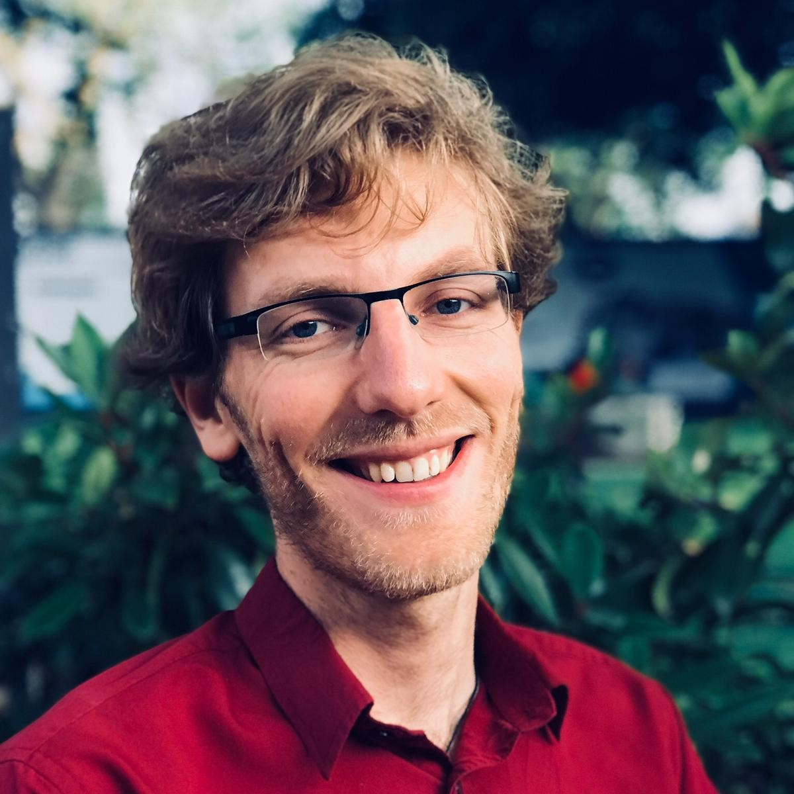

## Task Force Lead

<!--rehype:style=width:200px;&class=rounded-full-->
[**Mary Beth Neff**](https://www.hf.uio.no/ifikk/english/people/aca/philosophy/temporary/maryen/)<!--rehype:target=_blank--> (_University of Oslo, Norway_)

## Working Group Leads

<!--rehype:style=width:200px;&class=rounded-full-->
[**Isaac Handley-Miner**](https://moralitylab.bc.edu/people/isaac-handley-miner-2/)<!--rehype:target=_blank--> (_Boston College, USA_)

<!--rehype:style=width:200px;&class=rounded-full-->
[**Agata Bochynska**](https://www.ub.uio.no/english/about/people/samdig/open-research/agatabo/)<!--rehype:target=_blank--> (_University of Oslo, Norway_)

## Members

<!--rehype:style=width:200px;&class=rounded-full-->
[**Caroline Zygar-Hoffmann**](https://psycaroly.github.io/)<!--rehype:target=_blank--> (_Ludwig Maximilian University of Munich & Charlotte Fresenius Hochschule, Germany_)

<!--rehype:style=width:200px;&class=rounded-full-->
[**Hannah Lönneker**](https://uni-tuebingen.de/en/faculties/faculty-of-science/departments/psychology/research-groups/diagnostics-and-cognitive-neuropsychology/research-group/staff/hannah-dorothea-loenneker/)<!--rehype:target=_blank--> (_University of Tübingen, Germany_)

<!--rehype:style=width:200px;&class=rounded-full-->
[**Johanna Tomczak**](https://gorilla.sc/about/)<!--rehype:target=_blank--> (_Gorilla Experiment Builder, UK_)

<!--rehype:style=width:200px;&class=rounded-full-->
[**Kai Li Chung**](https://www.nottingham.edu.my/Psychology/People/kaili.chung)<!--rehype:target=_blank--> (_University of Nottingham Malaysia, Malaysia_)

<!--rehype:style=width:200px;&class=rounded-full-->
[**Chris Graham**](https://www.linkedin.com/in/christopher-j-graham/)<!--rehype:target=_blank--> (_Royal College of Physicians of Edinburgh, Scotland_)

<!--rehype:style=width:200px;&class=rounded-full-->
[**Priya Silverstein**](https://www.priyasilverstein.com/)<!--rehype:target=_blank--> (_Ashland University, USA_)

<!--rehype:style=width:200px;&class=rounded-full-->
[**Lukas Wallrich**](https://www.lukaswallrich.coffee/)<!--rehype:target=_blank--> (_Birkbeck University of London, UK_)

<!--rehype:style=width:200px;&class=rounded-full-->
[**Julia Beitner**](https://www.juliabeitner.com/)<!--rehype:target=_blank--> (_Central Institute of Mental Health, Germany_)

<!--rehype:style=width:200px;&class=rounded-full-->
[**Mahmoud Elsherif**](https://www.linkedin.com/in/mahmoud-elsherif-020194134/)<!--rehype:target=_blank--> (_Independent Researcher, UK_)

<!--rehype:style=width:200px;&class=rounded-full-->
[**Neele Henriette Heiser**](https://scholar.google.com/citations?user=O1hLYnYAAAAJ&hl=de&oi=ao/)<!--rehype:target=_blank--> (_University of Geneva, Switzerland_)

<!--rehype:style=width:200px;&class=rounded-full-->
[**Yashvin Seetahul**](https://www.uibk.ac.at/de/psychologie/mitarbeiter/seetahul/)<!--rehype:target=_blank--> (_University of Innsbruck, Austria_)

<!--rehype:style=width:200px;&class=rounded-full-->
[**Justin Sulik**](http://justinsulik.com/)<!--rehype:target=_blank--> (_Ludwig Maximilian University of Munich, Germany_)

<!--rehype:style=width:200px;&class=rounded-full-->
[**Bjørn Sætrevik**](https://www4.uib.no/finn-ansatte/Bj%C3%B8rn.S%C3%A6trevik)<!--rehype:target=_blank--> (_University of Bergen, Norway_)

## Past Members
[**Rachel Hayes-Harb**](https://profiles.faculty.utah.edu/u0459139) (_University of Utah, USA_); [**Shannon Barrios**](https://profiles.faculty.utah.edu/u0907833) (_University of Utah, USA_); [**Jade Pickering**](https://gorilla.sc/about/) (_Gorilla Experiment Builder, UK_)
